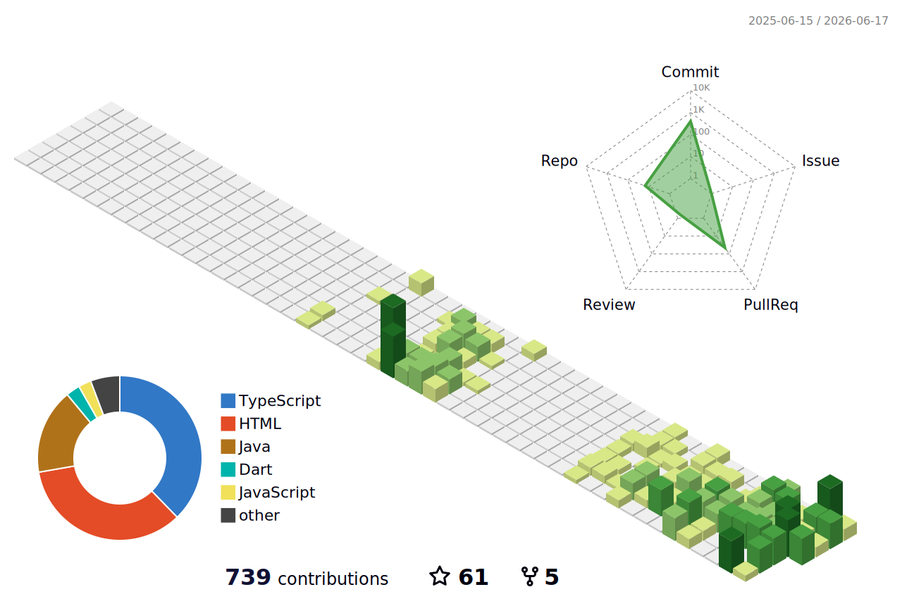

  

## About Me

Hey, I'm **St0ff3l**, a Computer Science student at **USM**. 

Just sharing what I'm learning and building.

---

## Languages and Tools

   
   
   
   
   
   
   
   
   
   
   
  

---

## Stats & Contributions

### 3D Contribution Profile

  

### Activity Metrics

  
  

  

