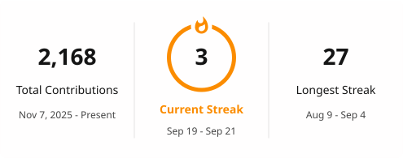

## 👨‍💻 About Me

Hey, I'm **St0ff3l**, a Computer Science student at **USM**. 

Just sharing what I'm learning and building.

---

## Stats & Contributions

  
  

### Activity Metrics

  <picture>
    <source media="(prefers-color-scheme: dark)" srcset="./profile/streak-dark.svg">
    <source media="(prefers-color-scheme: light)" srcset="./profile/streak-light.svg">
    
  </picture>
  <picture>
    <source media="(prefers-color-scheme: dark)" srcset="./profile/stats-dark.svg">
    <source media="(prefers-color-scheme: light)" srcset="./profile/stats-light.svg">
    
  </picture>

  <picture>
    <source media="(prefers-color-scheme: dark)" srcset="./profile/activity-dark.svg">
    <source media="(prefers-color-scheme: light)" srcset="./profile/activity-light.svg">
    
  </picture>

---

## My Skill Set

  
  
  
  
  
  
  
  
  
  
  
  
  
  
  
  
  
  
  
  
  
  
  

